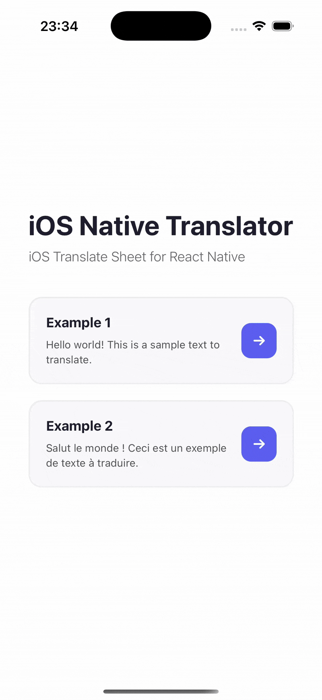

# React Native iOS Translate Sheet

<p align="center">
  A React Native library that brings the native iOS 17.4+ Translation Sheet to your React Native applications.
</p>

<p align="center">
  <a href="https://github.com/huextrat/react-native-ios-translate-sheet/blob/main/LICENSE">
    
  </a>
  <a href="https://www.npmjs.com/package/react-native-ios-translate-sheet">
    
  </a>
  <a href="https://www.npmjs.com/package/react-native-ios-translate-sheet">
    
  </a>
</p>

> **Note**: If you need to perform multiple translations and retrieve the translated text to display within your app, consider using [react-native-ios-translate-tasks](https://github.com/huextrat/react-native-ios-translate-tasks) instead. This library is focused on providing the native iOS translation sheet UI experience.

## Features

- 🔄 Seamless integration with iOS native translation capabilities
- 🌐 Access to all languages supported by iOS translation
- 📱 Native iOS UI and interactions
- 🏗️ Supports old & new arch on RN 0.76+
- ⚙️ Powered by SwiftUI's [translationPresentation](https://developer.apple.com/documentation/swiftui/view/translationpresentation(ispresented:text:attachmentanchor:arrowedge:replacementaction:)) API under the hood

## Platform Compatibility

This library is designed specifically for iOS 17.4 and above. It can be safely installed in your React Native project regardless of your target iOS version or if you're developing for Android. However, please note:

- On iOS versions below 17.4, the translation sheet will not appear and the `translate` function will silently do nothing
- On Android devices, the translation functionality is not available and the `translate` function will silently do nothing

## Installation

```sh
yarn add react-native-ios-translate-sheet
```
or
```sh
npm install react-native-ios-translate-sheet
```

Then, install the native dependencies:

```sh
cd ios && pod install
```

## Usage

1. First, wrap your app (or the part where you want to use the translation sheet) with the `IOSTranslateSheetProvider`:

```tsx
import { IOSTranslateSheetProvider } from 'react-native-ios-translate-sheet';

function App() {
  return (
    <IOSTranslateSheetProvider>
      {/* Your app content */}
    </IOSTranslateSheetProvider>
  );
}
```

2. Then, use the `useIOSTranslateSheet` hook in any component where you want to trigger the translation sheet:

```tsx
import { useIOSTranslateSheet } from 'react-native-ios-translate-sheet';

function MyComponent() {
  const { presentIOSTranslateSheet } = useIOSTranslateSheet();

  const handleTranslate = () => {
    presentIOSTranslateSheet('Text to translate');
    // Optional: You can pass an opacity value (0-1) as a second parameter
    // presentIOSTranslateSheet('Text to translate', 0.5);
  };

  return (
    <Button 
      title="Translate" 
      onPress={handleTranslate} 
    />
  );
}
```

### Checking Platform Support

The `useIOSTranslateSheet` hook provides an `isSupported` boolean that you can use to check if the translation functionality is available on the current device:

```tsx
const { isSupported } = useIOSTranslateSheet();
```

Note: The translation sheet will only appear on iOS devices running version 17.4 or later. On other platforms or iOS versions below 17.4, the `presentIOSTranslateSheet` function will do nothing.

## Example

<center>

</center>

## Contributing

We welcome contributions! Please see our [Contributing Guide](CONTRIBUTING.md) for more details.

## License

This project is licensed under the MIT License - see the [LICENSE](LICENSE) file for details.

## Support

If you like this project, please consider supporting it by giving it a ⭐️ on GitHub!
